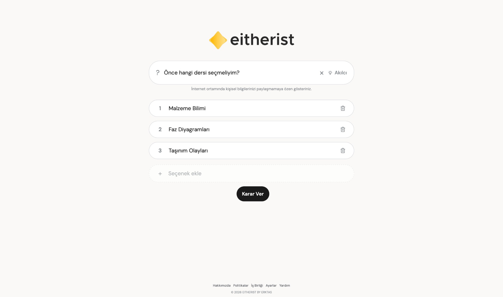
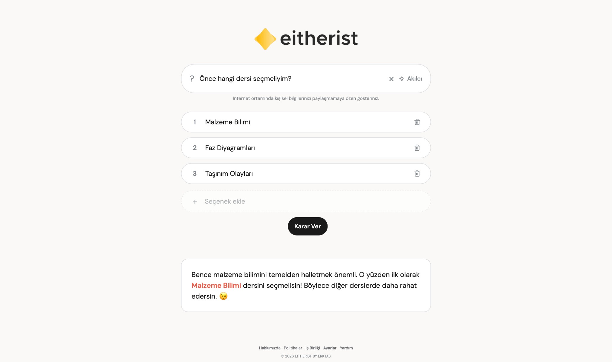
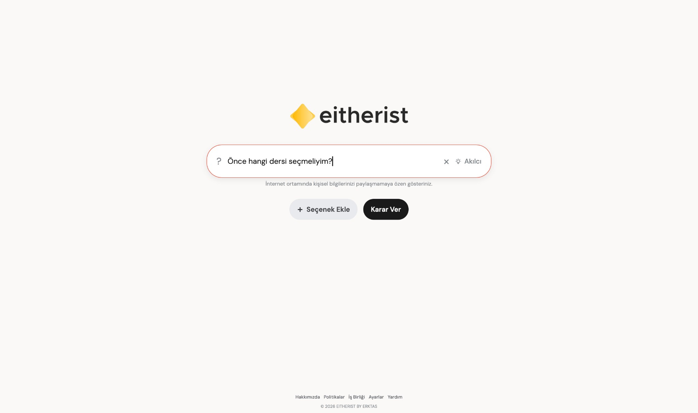
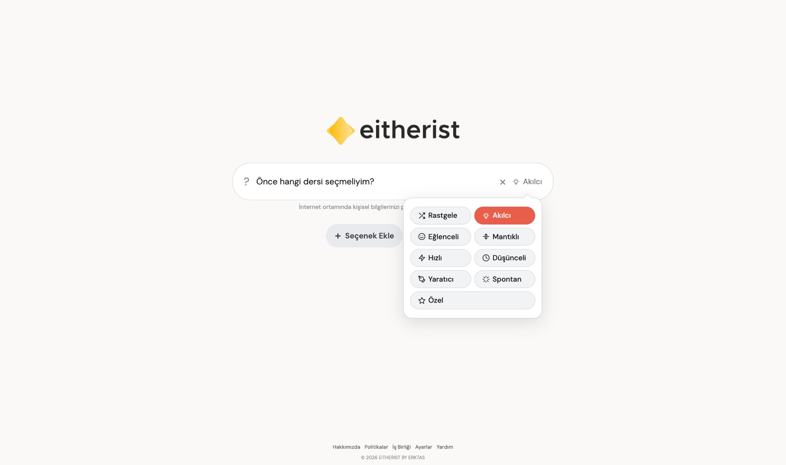

<div align="center">

# ✨ Eitherist

**Karar vermekte zorlananlar için rastgele veya yapay zeka destekli karar verme asistanı**

[](https://opensource.org/licenses/MIT)
[](https://firebase.google.com)
[](https://ai.google.dev)

[Kurulum](#-kendi-eitheristinizi-kurun) · [Katkıda Bulun](#-katkıda-bulunma)

</div>

---

## 🎯 Nedir?

Eitherist, günlük kararlarınızda size yardımcı olan hafif bir web uygulamasıdır. Sorunuzu yazın, seçenekleri ekleyin, mod seçin — gerisi bize kalsın.

| Mod | Açıklama |
|-----|----------|
| 🎲 **Rastgele** | Anlık, keyfe keder bir seçim |
| 🧠 **Akılcı** | Mantıklı, düşünülmüş öneri |
| 😄 **Eğlenceli** | Eğlence odaklı karar |
| ⚡ **Hızlı** | Hızlı sonuç |
| 💡 **Yaratıcı** | Sıra dışı tercihler |

*…ve daha fazlası*

---

## 📸 Arayüz

| Ana sayfa | Soru & seçenekler | AI karar sonucu |
|:---:|:---:|:---:|
|  |  |  |

| Soru yazma | Mod seçici |
|:---:|:---:|
|  |  |

---
## ✨ Özellikler

- **8+ mod** — Rastgele, Akılcı, Eğlenceli, Mantıklı, Hızlı, Düşünceli, Yaratıcı, Spontan
- **Gemini AI** — Rastgele hariç tüm modlarda gerçek yapay zeka
- **Firebase** — Firestore + Cloud Functions
- **Tema** — Açık, koyu ve loş mod
- **Responsive** — Mobil ve masaüstünde aynı deneyim

---

## 🚀 Kendi Eitherist'inizi Kurun

### Gereksinimler

- [Node.js](https://nodejs.org) (Firebase CLI için)
- [Firebase](https://console.firebase.google.com) hesabı
- [Google AI Studio](https://aistudio.google.com/apikey) (Gemini API key)

### Kurulum

```bash
# 1. Klonlayın
git clone https://github.com/canertash/eitherist.git
cd eitherist

# 2. Firebase config
cp firebase-config.example.js firebase-config.js
# firebase-config.js dosyasını kendi değerlerinizle doldurun

# 3. Firebase projesine bağlayın
firebase login
firebase use --add

# 4. Gemini API key (AI modları için)
firebase functions:secrets:set GEMINI_API_KEY

# 5. Deploy
firebase deploy
```

**Canlı adres:** `https://YOUR_PROJECT_ID.web.app`

### Yerel geliştirme

```bash
npx serve .
```

`http://localhost:3000` üzerinden test edebilirsiniz. Config yoksa sadece Rastgele modu çalışır.

---

## 📁 Proje Yapısı

```
eitherist/
├── index.html          # Ana sayfa
├── app.js              # Uygulama mantığı
├── styles.css          # Tema ve stiller
├── firebase-config.example.js
├── firestore.rules     # Güvenlik kuralları
├── firestore.indexes.json
├── functions/          # Cloud Functions (AI tetikleyici)
│   └── index.js
└── assets/             # Logo, favicon, ikonlar
```

---

## 🔒 Güvenlik

- `firebase-config.js` ve `.firebaserc` `.gitignore`'da — **commit etmeyin**
- Karakter limitleri Firestore Rules ve Cloud Function'da uygulanır
- Gemini API anahtarı Firebase Secrets'ta saklanır

---

## 🤝 Katkıda Bulunma

1. Fork edin
2. Feature branch oluşturun (`git checkout -b feature/amazing`)
3. Commit edin (`git commit -m 'feat: Add amazing feature'`)
4. Push edin (`git push origin feature/amazing`)
5. Pull Request açın

---

## 📄 Lisans

[MIT](LICENSE) © 2026 [Erktas](https://erktas.net)
